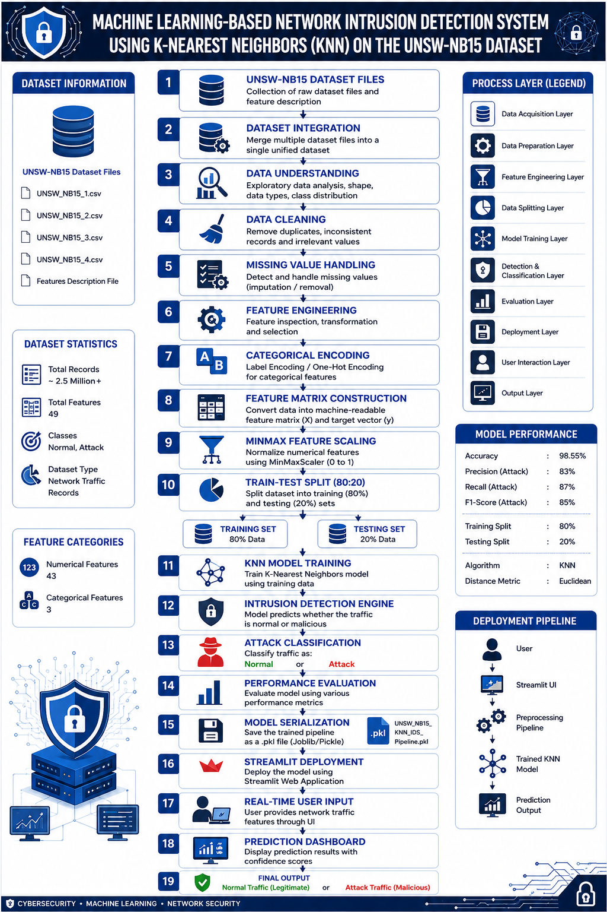

# 🛡️ Machine Learning-Based Network Intrusion Detection System Using K-Nearest Neighbors (KNN) on the UNSW-NB15 Dataset

### 📌 Project Overview

This project presents a Machine Learning-Based Network Intrusion Detection System (IDS) developed using the K-Nearest Neighbors (KNN) algorithm on the UNSW-NB15 dataset.

The objective is to automatically distinguish between legitimate network traffic and malicious network activities by learning patterns from network flow records. The trained model is integrated into a Streamlit web application for real-time intrusion prediction and user interaction.

### 🚨 Problem Statement

Modern computer networks are constantly exposed to cyber threats such as:

- Unauthorized access
- Denial of Service (DoS)
- Reconnaissance attacks
- Exploitation attempts
- Malicious traffic activities

Traditional signature-based security systems struggle to identify previously unseen attacks.

This project leverages machine learning techniques to build an intelligent Intrusion Detection System capable of identifying suspicious network behavior from traffic records.

### 🎯 Objectives
- Build a machine learning-based intrusion detection system.
- Detect malicious network traffic using KNN.
- Perform comprehensive data preprocessing and feature engineering.
- Reduce the impact of noisy and inconsistent data.
- Evaluate model performance using classification metrics.
- Deploy the trained model through Streamlit for real-time predictions.

### 📂 Dataset Description

#### Dataset

**UNSW-NB15 Dataset**

The UNSW-NB15 dataset is a modern cybersecurity benchmark dataset developed for Network Intrusion Detection research.

**Dataset Characteristics**

| Property | Value |
| :--- | :--- |
| **Dataset Type** | Network Traffic Records |
| **Approx Records** | 2.5 Million+ |
| **Total Features** | 49 |
| **Classes** | Normal, Attack |
| **Classification Type** | Binary Classification |

**Feature Categories**

| Type | Count |
| :--- | :--- |
| **Numerical Features** | 43 |
| **Categorical Features** | 3 |

**Target Variable**

| Variable | Description |
| :--- | :--- |
| **Label** | 0 = Normal Traffic, 1 = Attack Traffic |

**Target Leakage Prevention**

The **attack_cat** column was removed before training because the project performs binary classification using the Label column.

### 🛠️ Technology Stack

**Programming Language**
- Python
**Machine Learning Libraries**
- Pandas
- NumPy
- Scikit-Learn
- Joblib
  
**Deployment**
- Streamlit
  
**Development Environment**
- Jupyter Notebook
- VS Code

### 🔄 Machine Learning Pipeline

**1. Data Collection**
- UNSW-NB15 raw dataset files collected
- Feature description files integrated

**2. Dataset Integration**

Multiple dataset files merged into a unified dataset.

**3. Data Understanding**

Performed:

- Dataset inspection
- Feature analysis
- Data type verification
- Class distribution analysis

**4. Data Cleaning**

Performed:

- Duplicate checking
- Removal of irrelevant records
- Consistency verification

**5. Missing Value Handling**

- Missing values identified
- Appropriate preprocessing applied before model training

**6. Feature Engineering**

Performed:

- Feature inspection
- Feature transformation
- Feature preparation

**7. Categorical Encoding**

Categorical variables transformed using:

OneHotEncoder(
    sparse_output=False,
    handle_unknown='ignore'
)

**8. Feature Matrix Construction**

- X = dataset.drop(columns=['Label', 'attack_cat'])
- y = dataset[['Label']]

**9. Feature Scaling**

Numerical features scaled using:

MinMaxScaler()

Scaling range:

0 → 1

**10. Train-Test Split**

- train_size = 0.8
- random_state = 44
- stratify = y

| Dataset |	Percentage |
| :--- | :--- |
| **Training** |	80% |
| **Testing**	| 20% |

**11. Model Training**

Algorithm:

KNeighborsClassifier()

### 🏗️ System Architecture

The complete architecture consists of:

1. Dataset Acquisition Layer
2. Dataset Integration Layer
3. Data Understanding Layer
4. Data Cleaning Layer
5. Missing Value Handling Layer
6. Feature Engineering Layer
7. Categorical Encoding Layer
8. Feature Matrix Construction Layer
9. MinMax Feature Scaling Layer
10. Train-Test Split Layer
11. KNN Model Training Layer
12. Intrusion Detection Layer
13. Attack Classification Layer
14. Performance Evaluation Layer
15. Model Serialization Layer
16. Streamlit Deployment Layer
17. User Input Layer
18. Prediction Dashboard Layer
19. Final Output Layer

### Architecture Diagram

The following diagram illustrates the complete workflow of the proposed Intrusion Detection System.

### 🤖 Model Details

**Algorithm**

K-Nearest Neighbors (KNN)

**Distance Metric**

Euclidean Distance

**Why KNN?**
- Simple and interpretable
- Effective for classification problems
- Performs well on normalized feature spaces
- Suitable for network traffic pattern recognition

**Training Process**
1. Preprocess dataset
2. Encode categorical features
3. Scale numerical features
4. Split training/testing data
5. Train KNN classifier
6. Evaluate model performance
7. Serialize trained pipeline

### 📊 Performance Evaluation

**Classification Report**

| Metric | Attack Class |
| :--- | :--- |
| **Precision** | 0.84 |
| **Recall** | 0.88 |
| **F1 Score** | 0.86 |

**Overall Accuracy**

| Metric | Value |
| :--- | :--- |
| **Accuracy** | ~98.6–99% |

**Confusion Matrix**

| Actual / Predicted | Normal | Attack |
| :--- | :---: | :---: |
| **Normal** | 18,873 | 159 |
| **Attack** | 114 | 854 |

### 💾 Model Serialization

The complete pipeline was saved using Joblib.

joblib.dump(...)

Serialized Components:

- Trained KNN Model
- OneHot Encoder
- MinMax Scaler

Output File:

UNSW_NB15_KNN_IDS_Pipeline_v1.pkl

### ⚙️ Installation

git clone https://github.com/yourusername/UNSW-NB15-KNN-IDS.git

cd UNSW-NB15-KNN-IDS

pip install -r requirements.txt

### 📈 Results and Discussion

The developed KNN-based Intrusion Detection System achieved high overall classification performance while maintaining strong detection capability for attack traffic.

The use of One-Hot Encoding and MinMax Scaling improved model compatibility and helped KNN effectively learn network traffic patterns.

The model demonstrates that machine learning can be successfully applied for practical cybersecurity threat detection.

### ✅ Advantages

- High classification accuracy
- Simple and interpretable model
- Real-time deployment capability
- End-to-end ML pipeline

### ⚠️ Limitations

- KNN inference becomes slower with larger datasets
- Sensitive to feature scaling
- Performance may degrade with highly imbalanced classes
- Requires storing training data for prediction
- Cybersecurity-focused application

### 🚀 Future Enhancements

- Hyperparameter tuning
- Ensemble learning methods
- Deep Learning IDS models
- Multi-class attack classification
- Real-time packet capture integration
- Cloud deployment
- Explainable AI integration

### 📚 References

- UNSW-NB15 Dataset
- Scikit-Learn Documentation
- Streamlit Documentation
- Network Intrusion Detection Research Papers

### 👨‍💻 Author

Yaswanth Reddy M.

B.Tech – Electronics and Communication Engineering

Machine Learning | Data Science
